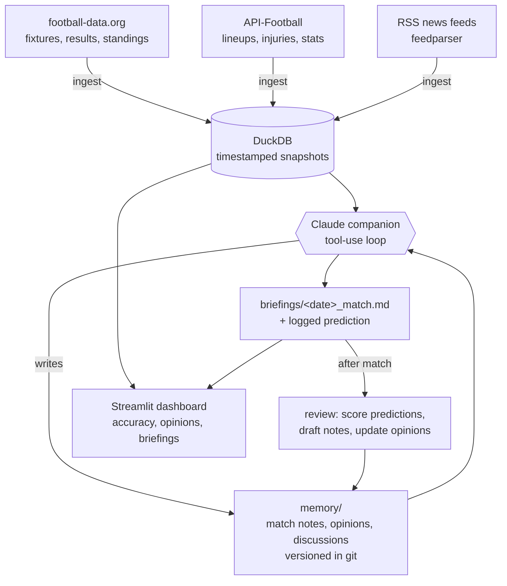

# Football Companion Agent

A **conversational football analyst — a *friend* you talk football with**, focused
on **La Liga and the Champions League, with FC Barcelona at the center**. It chats
about matches, form, tactics, and formations using **real current data** (never
invented numbers), writes **pre-match briefings** with a **logged prediction**, and
after each matchday **reviews what happened and scores its own predictions**. It
keeps a **written memory across the whole season** — so in March it remembers what
it believed in September, and why it changed its mind.

Not a generic chatbot. The engineering value is three things: a **live data
pipeline**, a **memory system**, and a **self-evaluation loop**.

> **Resume framing:** conversational analyst agent with persistent memory, tool use
> over live sports data, and self-evaluating predictions across a full season.

## Status
🚧 **Phase 0 (Setup) — in progress.** Built in phases; see `CLAUDE.md` for the plan
and `DECISIONS.md` for the reasoning behind each step.

## How "learning" works here
**No fine-tuning, no ML models.** The companion learns the way an agent learns:
fresh data ingested weekly + written memory + scored predictions + opinions updated
on evidence.

## Architecture (v1)


_(Diagram will be refined at the end of each phase as pieces get built.)_

## The commands (target for v1)
| Command | What it does |
|---|---|
| `python -m companion.chat` | Open a conversation — tools + memory live. |
| `python -m companion.ingest` | Pull latest fixtures/results/standings/lineups/news into DuckDB. |
| `python -m companion.briefing --next-barca` | Write a pre-match briefing + log a prediction. |
| `python -m companion.review --since <date>` | Score predictions, draft match notes, update opinions. |
| `python -m companion.stats` | Prediction accuracy so far, overall and by competition. |

## Setup (Windows / PowerShell)

```powershell
# 1. Create and activate a virtual environment
python -m venv .venv
.\.venv\Scripts\Activate.ps1

# 2. Install dependencies + make the package importable
pip install -r requirements.txt
pip install -e .

# 3. Add your API keys (all free)
copy .env.example .env
# then edit .env: ANTHROPIC_API_KEY, FOOTBALL_DATA_API_TOKEN, API_FOOTBALL_KEY

# 4. Prove the football API works (Barcelona's next 5 fixtures + La Liga top 5)
python -m companion.check_api
```

## Data sources (free tiers — verified in Phase 1)
- **football-data.org** — fixtures, results, standings (La Liga + Champions League)
- **API-Football** (free plan, 100 req/day) — lineups, formations, injuries, stats
- **RSS news** (Guardian, ESPN FC, …) via `feedparser`

## Project layout
```
src/companion/      # the package (all code lives here)
tests/              # pytest tests for the deterministic parts
memory/             # the versioned "brain": match notes, opinions, discussions
briefings/          # generated pre-match briefings (with logged predictions)
data/               # DuckDB snapshot file (gitignored)
CLAUDE.md           # operating rules for the build
DECISIONS.md        # plain-English reasoning log (interview prep)
```

## Tech stack
Python 3.11+ · football-data.org · API-Football · feedparser (RSS) · DuckDB ·
Anthropic SDK · Streamlit · pytest · python-dotenv
