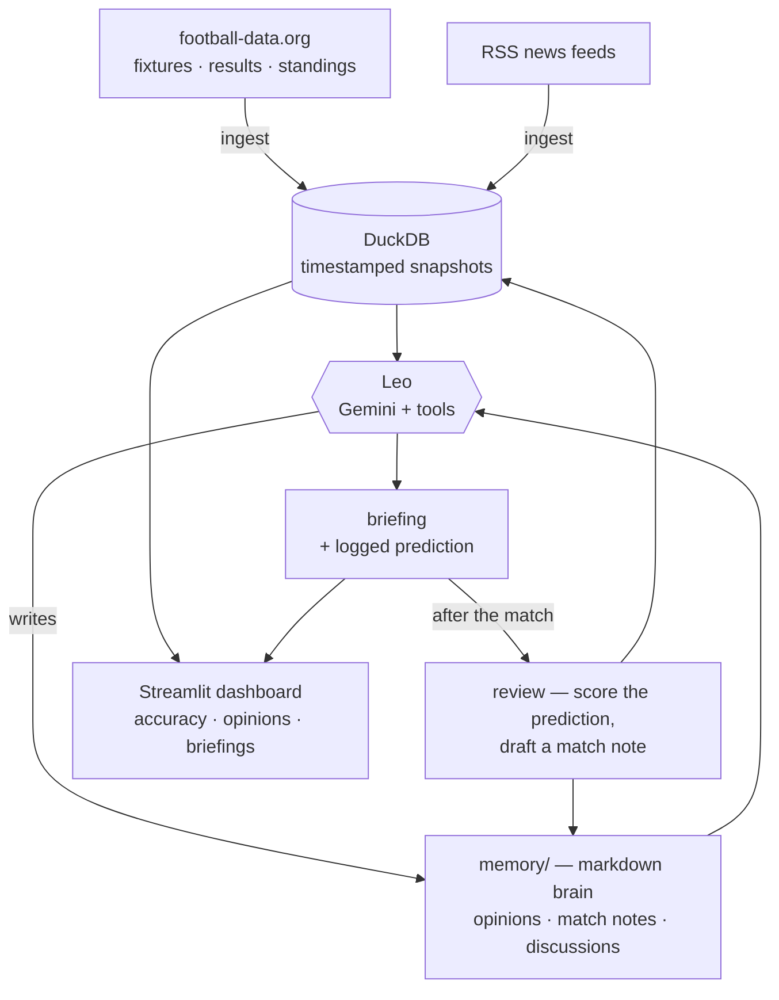

# ⚽ Leo — Football Companion

**Leo is a conversational football analyst** you talk football with — focused on
**La Liga and the Champions League, with FC Barcelona at heart.** He's not a generic
chatbot: he pulls **real current data** through tools (never invented numbers), keeps
a **written memory across the whole season**, writes **pre-match briefings with a
logged prediction**, and after each matchday **scores his own predictions** and
updates his opinions on the evidence.

> **Resume framing:** a conversational analyst agent with persistent memory, tool use
> over live sports data, and self-evaluating predictions across a full season.

## Status
✅ **v1 complete** — Phases 0–4. Leo chats with real data, writes briefings, logs
predictions, and scores himself. Built in phases; see [`CLAUDE.md`](CLAUDE.md) for the
plan, [`DECISIONS.md`](DECISIONS.md) for the reasoning, and
[`LEARNING_LOG.md`](LEARNING_LOG.md) for the what/why behind every step.


_(Add your own screenshot: run the dashboard and drop the image in `screenshots/`.)_

## What makes it serious (three pillars)
1. **Live data pipeline** — fixtures/results/standings + news, cached in DuckDB.
2. **Memory system** — a versioned, human-readable "brain" (`memory/`).
3. **Self-evaluation loop** — predictions logged *before* matches, scored *after*.

## How "learning" works here
**No fine-tuning, no ML, no training dataset.** Leo gets sharper the way a real
analyst does: fresh data each week + a growing written memory + predictions scored
against reality + opinions updated *with a reason*. In March he still remembers what
he believed in September, and why it changed.

## Architecture



## The commands
| Command | What it does |
|---|---|
| `python -m companion.ingest` | Pull latest fixtures/results/standings/news into DuckDB |
| `python -m companion.chat` | Talk to Leo in the terminal — real data, real opinions, live memory |
| `streamlit run src/companion/webapp.py` | 💬 Talk to Leo in your **browser** (web chat + live stats) |
| `python -m companion.briefing --next-barca` | Write a pre-match briefing + log a prediction |
| `python -m companion.review` | Score predictions vs results, draft match notes |
| `python -m companion.stats` | Prediction accuracy so far (overall + by competition) |
| `streamlit run src/companion/dashboard.py` | The dashboard (accuracy chart, opinions, briefings) |

## Setup (Windows / PowerShell)

```powershell
# 1. Create and activate a virtual environment
python -m venv .venv
.\.venv\Scripts\Activate.ps1

# 2. Install dependencies + make the package importable
pip install -r requirements.txt
pip install -e .

# 3. Add your API keys (all free)
copy .env.example .env
#    then edit .env:
#      GEMINI_API_KEY          — https://aistudio.google.com/apikey  (Leo's brain)
#      FOOTBALL_DATA_API_TOKEN — https://www.football-data.org       (the data)

# 4. Pull the data, then talk to Leo
python -m companion.ingest
python -m companion.chat
```

> **Free-tier note:** Leo runs on Google Gemini's free tier (`gemini-flash-latest`),
> which is rate-limited — pace your messages. The model is one config value in
> `agent.py`, so switching to a paid tier (or back to Claude) is a one-line change.

## The memory ("brain")
Human-readable markdown, committed to git — you can `git diff` how Leo's mind changed:
- `memory/opinions.md` — living takes, each with evidence + confidence + date.
- `memory/match_notes/` — one note per reviewed match (from Rushikesh's template).
- `memory/discussions.md` — a dated log of chats.
- Plus a `predictions` table in DuckDB (logged before, scored after).

## Data sources (free tiers)
- **football-data.org** — fixtures, results, standings (La Liga + Champions League).
- **RSS news** (Guardian, BBC, ESPN) via `feedparser`.
- *(API-Football's free plan can't access the current season, so structured
  lineups/injuries are parked for a paid tier / v2 — Leo uses news + your notes.)*

## Tech stack
Python 3.11+ · football-data.org + RSS · DuckDB · Google Gemini (`google-genai`) ·
Streamlit · pytest · python-dotenv

## Project layout
```
src/companion/     # the package: ingest, queries, tools, agent, chat, briefing,
                   #   review, stats, dashboard, memory, predictions, db, sources
tests/             # pytest (data parsing, memory I/O, prediction scoring)
memory/            # the versioned brain (opinions, match notes, discussions)
briefings/         # generated pre-match briefings (with logged predictions)
data/              # DuckDB snapshot file (gitignored)
```
