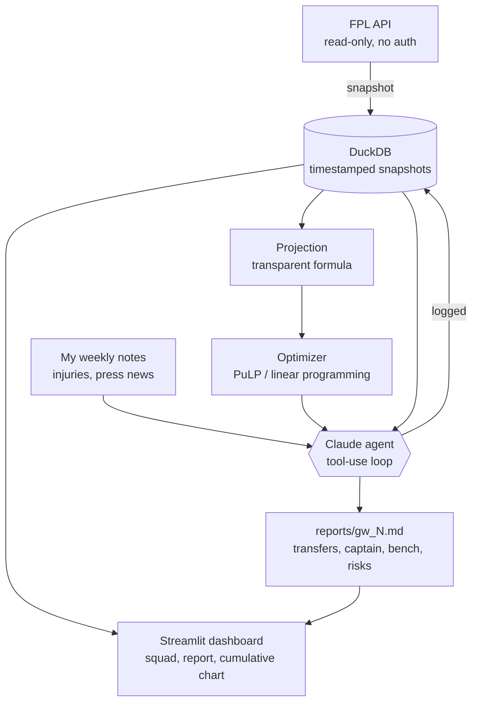

# FPL Manager Agent

An **autonomous Fantasy Premier League manager**. Each gameweek it pulls live FPL
data, projects player points with a transparent formula, optimizes a legal squad
under official FPL rules, applies Claude's judgment on top (injuries, rotation,
pasted news), and writes a recommendation report — transfers, captain, bench order,
with written reasoning. Picks are submitted manually on the FPL website; **the
program never logs into the FPL account.**

Over a season it tracks its results against two baselines and a human team.

> **Resume framing:** autonomous decision agent — LLM reasoning + constrained
> optimization + weekly feedback loop on live data, evaluated against baselines.

## Status
🚧 **Phase 0 (Setup) — in progress.** Built in phases; see `CLAUDE.md` for the plan
and `DECISIONS.md` for the reasoning behind each step.

## Architecture (v1)


_(Diagram will be refined at the end of each phase as pieces get built.)_

## The three commands (target for v1)
| Command | What it does |
|---|---|
| `snapshot` | Fetch live FPL data and append a timestamped copy into DuckDB. |
| `weekly --gw N` | Run the agent for gameweek N → write `reports/gw_N.md`. |
| `eval --gw N` | After the gameweek, fetch actual points and update the score tracks. |

## Setup (Windows / PowerShell)

```powershell
# 1. Create and activate a virtual environment
python -m venv .venv
.\.venv\Scripts\Activate.ps1

# 2. Install dependencies + make the package importable
pip install -r requirements.txt
pip install -e .

# 3. Add your Anthropic API key
copy .env.example .env
# then edit .env and paste your key from https://console.anthropic.com

# 4. Prove the FPL API works (prints the 5 most expensive players)
python -m fpl_agent.check_api
```

## Tech stack
Python 3.11+ · FPL API (read-only) · DuckDB · PuLP · Anthropic SDK · Streamlit ·
pytest · python-dotenv

## Project layout
```
src/fpl_agent/    # the package (all code lives here)
tests/            # pytest tests for the deterministic parts
reports/          # generated weekly reports (gw_N.md)
data/             # DuckDB snapshot file (gitignored)
CLAUDE.md         # operating rules for the build
DECISIONS.md      # plain-English reasoning log (interview prep)
```
